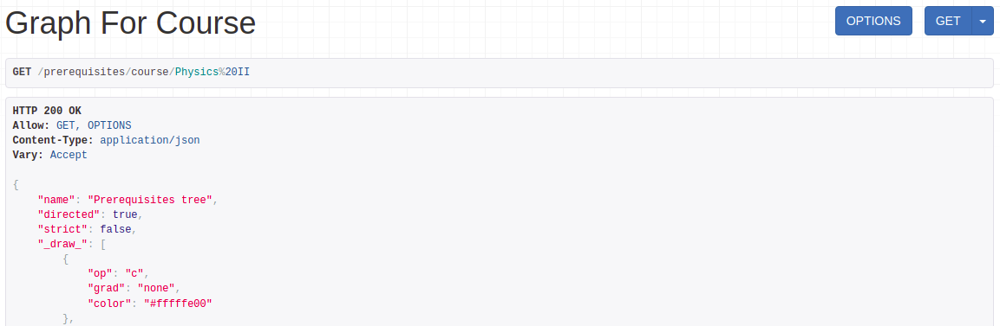

# Prerequisites tree

## Project first setup
1. Create virtual environment
`python3 -m venv .venv`
2. Activate venv
`. .venv/bin/activate`
3. Install all libraries
`pip install -r requirements.txt`
4. Install graphviz `sudo apt-get update -y` , `sudo apt-get install -y graphviz`
5. Add database to prerequisites/settings.py
6. Run `python3 manage.py migrate` to apply migrations and `python3 manage.py runserver` to run server locally.

### Example of "get graph for one course" method usage

1. To get graph nodes use `response.data['objects']`
2. To get graph edges use `response.data['edges']`
